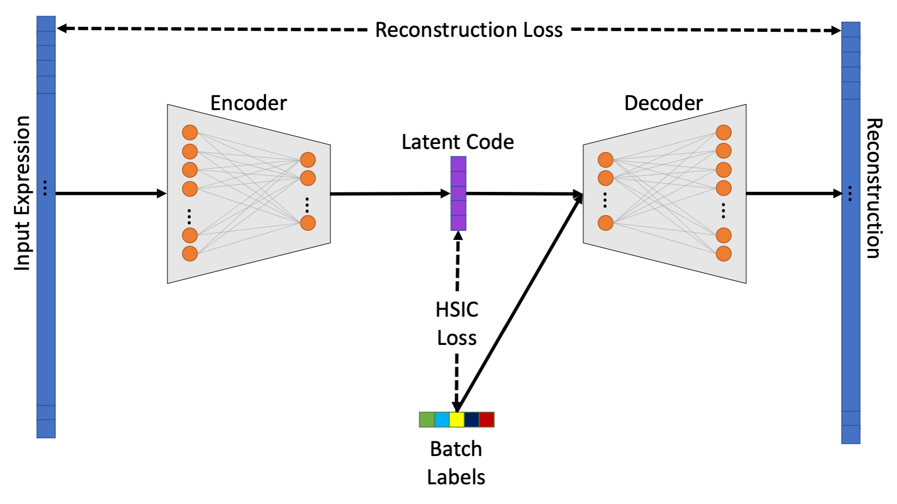

# HD-AE: Transferable representations of scRNA-seq data

---




HD-AE (the <ins>H</ins>ilbert-Schmidt <ins>D</ins>econfounded <ins>A</ins>uto<ins>e</ins>ncoder) is a package for producing generalizable (i.e., across
labs, technologies, etc.) embedding models for scRNA-seq data. HD-AE enables the training of "reference"
embedding models, that can later be used to embed data from future experiments into a common space _without
requiring any retraining of the model_. Please see <a href="https://www.biorxiv.org/content/10.1101/2021.04.13.439707v1">our preprint</a> for further technical details.


### What can you do with HD-AE?

* Train HD-AE models to embed scRNA-seq data from different sources into a common lower-dimensional space
* Share your pretrained models and reference sets of embeddings with collaborators
* Alternatively, you can download a pretrained HD-AE model and use it to embed your data and compare with previous reference datasets

### Installation

The simplest way to get started with HD-AE is to clone this repo and run 

```
pip install .
```

### Usage

See the `notebooks` folder for examples of using HD-AE.

### Reference

If you find HD-AE useful in your research, please consider citing <a href="https://www.biorxiv.org/content/10.1101/2021.04.13.439707v1">our preprint</a>.

